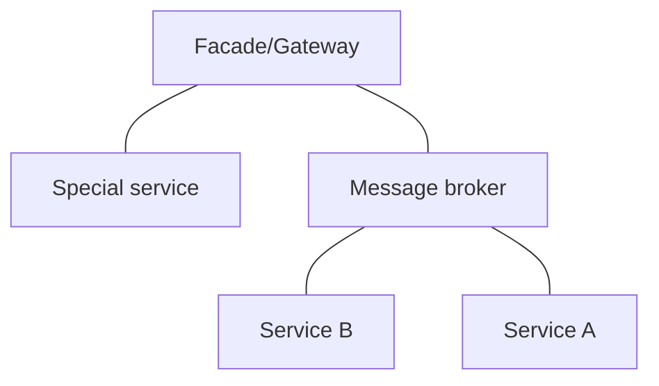
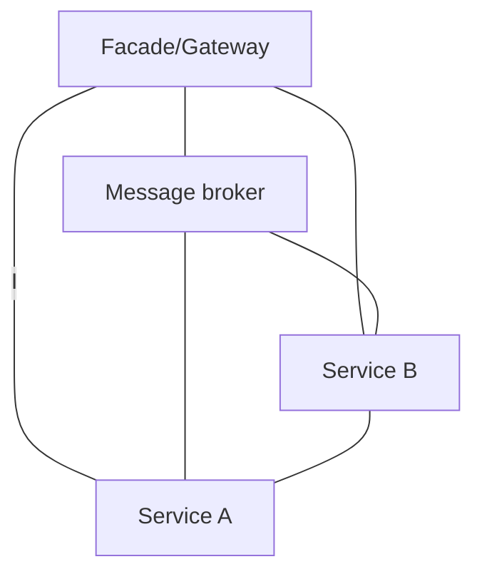
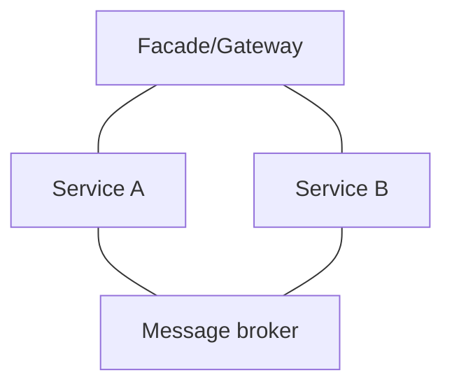

# Микросервисные паттерны на примере факторио

Моя попытка описать паттерны микросервисов используя игру Factorio :). Основная проблема при изучении микросервисов в том, что они не наглядны, хоть и кажутся простыми для понимания. Тут же масштабирование возникает **физически** - его можно увидеть, потрогать, и даже сыграть! Вполне возможно, что попытка не очень удачная и больше говорит о Факторио чем о микросервисах, но попробовать стоило.

## 1 Масштабирование

Зачем нам вообще масштабировать сервис\фабрику, ведь оно и так работает?
Конечно оно работает, пока нет большой нагрузки, но рано вам может начать нехватать производственных мощностей.

Например у нас есть производство железных пластин, которые затем используются для создания шестеренок:

Рисунок 1.1 - простейший завод.

Вроде бы ничего не предвещает беды, но теперь допустим нам понадобились заводы по производству патронов и труб.

Рисунок 1.2 - первая проблема.

Очевидно, что теперь нам не хватает пропускной способности конвеера, и фабрика шестеренок перестала работать.

Самое простое решение - улучшить конвеер или увеличить их количество (Вертикальное масштабирование). До какого то момента это будет работать, однако даже у самых лучших конвееров есть предел пропускной способности.

Рисунок 1.3 - мы улучшили конвееры, но и заводы стали больше.

Разделитель решил проблему полного отсутствия ресурсов, но теперь все 3 фабрики работают в полсилы. Мы можем поменять способ доставки на поезд\транспортных дронов, Поставить дорогостоящие модули на фабрику, стоимость производства которых, порой превышает стоимость всей базы и ресурсов вместе взятых. Но даже такие радикальные способы не решают проблему - нам постоянно нужно увеличивать масштабы производства.

Рисунок 1.4 - как выглядит горизонтальное масштабирование.

Следующий рисунок наглядно иллюстрирует важность горизонтального масштабирования:

Рисунок 1.4 - 2 вида фабрик.

Слева фабрика использующая модульную архитектуру, справа нет. Для того что бы расширить фабрику слева, нужно всего лишь скопировать и вставить чертеж, для правой же фабрики придется рефакторить все производство, или строить заново. [Пример хорошего горизонтального масштабирования в Factorio](https://youtu.be/dY2nxVNBHQs) Итак, теперь понятно зачем дробить производство на обособленные фабрики (микросервисы), и почему горизонтальным масштабированием легче управлять. Теперь разберем как.

## 2 Паттерны

### Фасад

Довольно удобный паттерн. Предоставляет единую точку доступа, избавляет от тонкостей реализации. Например. наш инженер решил заказать 100 металла, десяток бойлеров, и 5 паровых двигателей.

Рисунок 2.1 - фасад

Если бы не было фасада, ему пришлось бы самому узнавать где производится каждый ресурс, и лично забирать его от туда. Что очень неудобно и долго, да еще и опасно: он может либо повредить базу либо его собъет поезд.

### CQRS

Это разделение на команды, которые меняют состояние и ничего не возвращают и запросы которые возвращают данные ничего не изменяя.

Рисунок 2.2 - CQRS

### Шина сообщений

### Event sourcing

### Кластер

### Балансировщик нагрузки

### Saga

### 2PC

### Sharding

### Агрегатор

## 3 Передача сообщений

Начнем с простой схемы.
*Знакомые схемы...*

*К сожалению Mermaid плохо работает со сложными схемами*

## 4 Factorio как способ собеседования

На хабре есть одна [статья](https://habr.com/ru/company/itsumma/blog/551622/), где компания использовала факторио для проведения собеседований.

### Плюсы данного подхода

- Интересный новый опыт.
- Отличный тимбилдинг\айсбрейкинг.
- Не требует знания конкретных библиотек\языков.
- Процесс рефакторинга большой фабрики по сложности не устпупает реальным программам

### Минусы данного подхода

- Требуется хороший пк.
- Готовые чертежи фабрик можно найти в интеренете - Решается модами рандомазейрами рецептов и дополнительными требованиями к чертежам.
- Необходимо убрать чисто геймплейные фишки (Врагов, ночь, вооружение...), Настроить процесс, что бы основное внимание уделялось проектированию фабрик.
- Вы можете найти фаната этой игры (Он может знать и использовать чертежи\паттерны не особо понимая какую проблему они решают), или наоборот кандидата, который вообще не любит игры.
